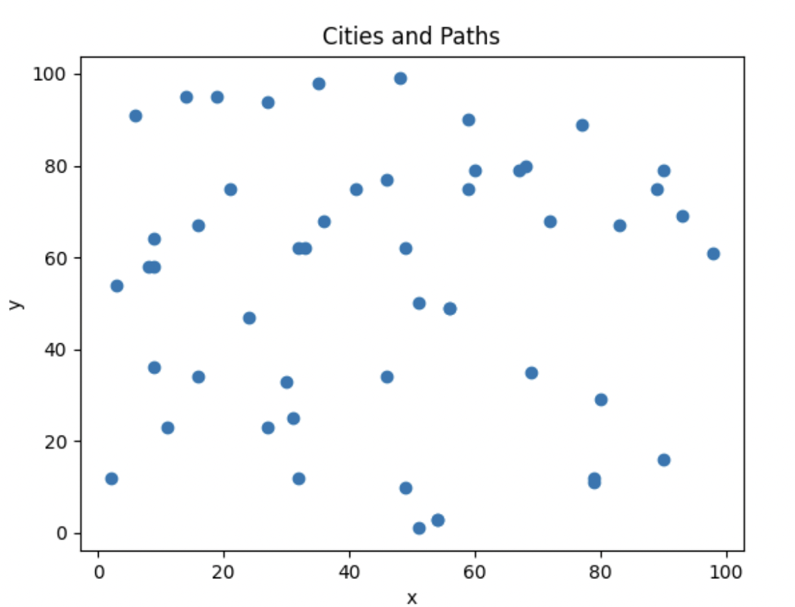
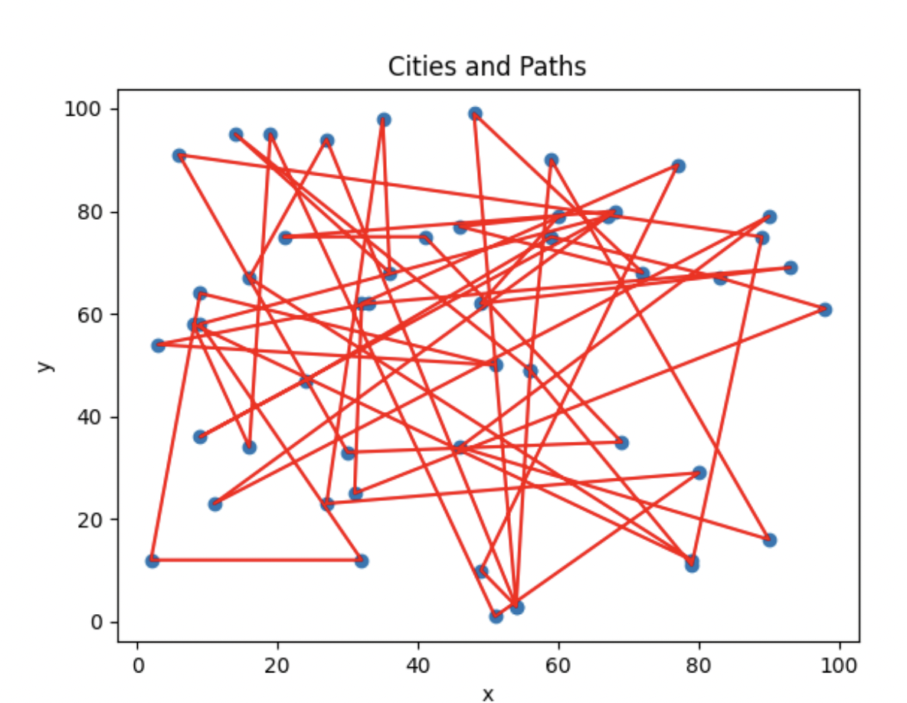
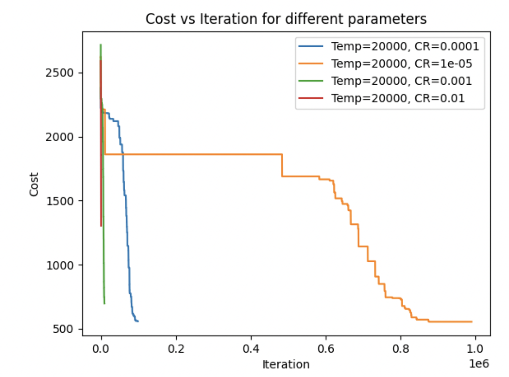
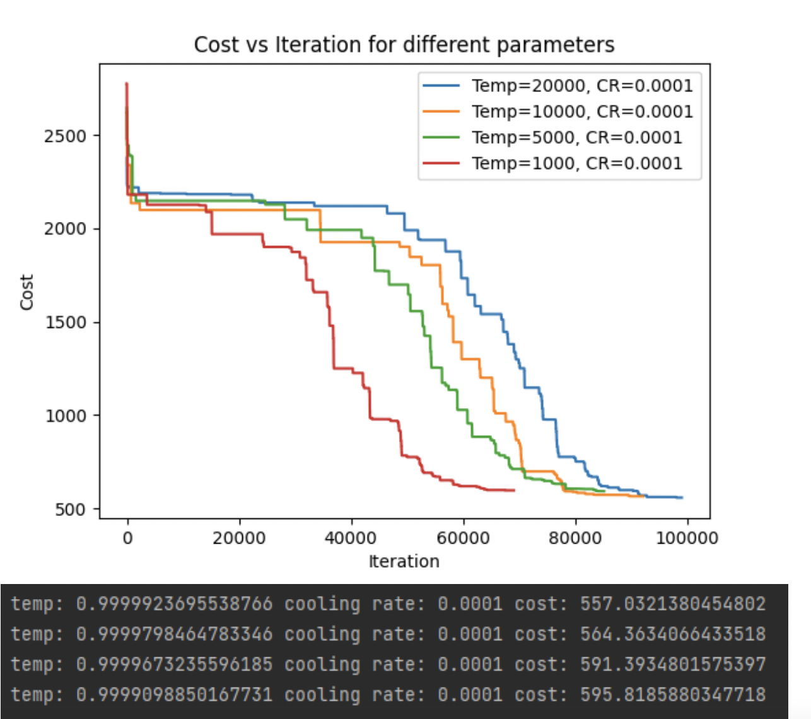
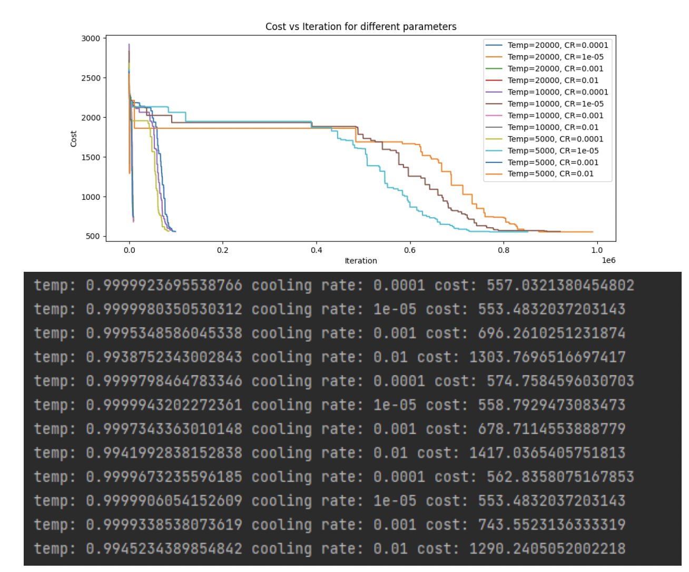
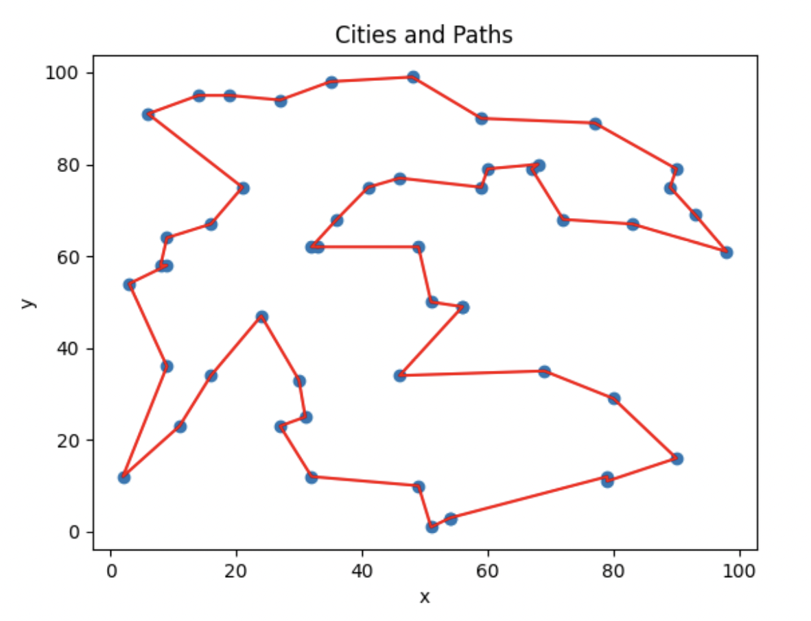

# Travelling-Salesman-Using-Simulated-Annealing
Applying Simulated Annealing Algorithm to find the solution to the Travelling Salesman Problem.

Problem visualization:

Random Solution:

Experimenting with different parameters:

Final Solutioin:

